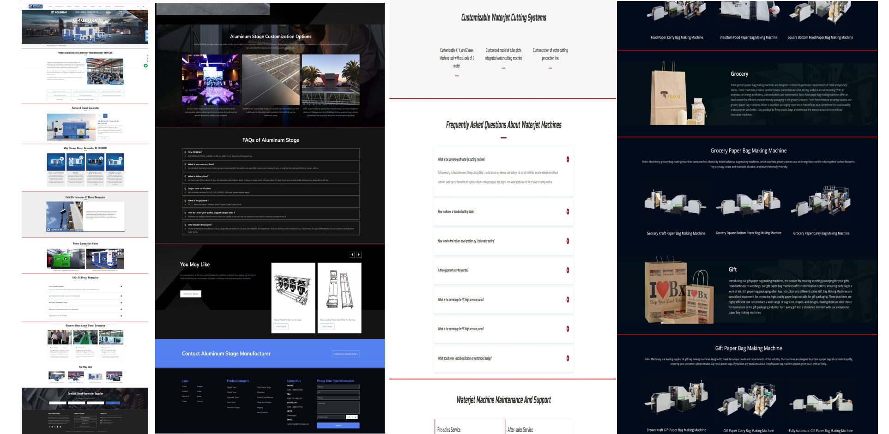

[](https://pypi.org/project/Web_page_Screenshot_Segmentation/) [](https://github.com/Tim-Saijun/Web-page-Screenshot-Segmentation/actions/workflows/python-publish.yml)[](https://pypi.org/project/Web_page_Screenshot_Segmentation/)   [](README-ZH.md) [](README.md)

## Introduction
This project is used to split the long screenshot of web pages into several parts based on the height of the text. The main idea is to find the low variation region of the image, and then find the split line in the low variation region. 

The output are small but complete images of the web page, which can be used to generate web pages using [Screen-to-code](https://github.com/abi/screenshot-to-code) or to train models.
More results can be found in the [images](images) directory.

## Getting started
### Install 
```bash
 pip install Web-page-Screenshot-Segmentation
```

## Using in the command line
### Obtain the height of the split line of the image
```bash
python -m Web_page_Screenshot_Segmentation.master -f "path/to/img"
```
The output looks like this: ` [6, 868, 1912, 2672, 3568, 4444, 5124, 6036, 7698] `. It is the height list of the split line of the image.

If you want to check the split line on the image, you can use the following command:
```bash
python -m Web_page_Screenshot_Segmentation.master -f "path/to/img" -s True
```
Then you can get the path to the result image.

### Draw the split lines on the image
```bash
python -m Web_page_Screenshot_Segmentation.drawer --image_file path/to/image.jpg --hl [100,200] --color (0,255,0)
```

### Split the image
```bash
python -m Web_page_Screenshot_Segmentation.spliter --f path/to/image.jpg -ht "[233,456]"
```
You will get the split image at the path returned by the command.

For details, please refer to the help information
```bash
python -m Web_page_Screenshot_Segmentation.master --help
python -m Web_page_Screenshot_Segmentation.drawer --help
python -m Web_page_Screenshot_Segmentation.spliter --help
```

## Using from the Source Code
 
### split_heights function

The `split_heights` function is used to split an image into several parts based on various thresholds. It takes the following parameters:

- `file_path`: The path of the image file.
- `split`: A boolean indicating whether to split the image.
- `height_threshold`: The height threshold of the low variation region.
- `variation_threshold`: The variation threshold of the low variation region.
- `color_threshold`: The threshold of the color difference.
- `color_variation_threshold`: The threshold of the color difference variation.
- `merge_threshold`: The threshold of the least distance between two lines.

The function returns a list of heights of the split lines if `split` is `False`, or the path of the split image if `split` is `True`.

#### Example usage

```python
import Web_page_Screenshot_Segmentation
from Web_page_Screenshot_Segmentation.master import split_heights

# Split the image at 'path/to/image.jpg' into several parts
split_image_path = split_heights(
    file_path='path/to/image.jpg',
    split=True,
    height_threshold=102,
    variation_threshold=0.5,
    color_threshold=100,
    color_variation_threshold=15,
    merge_threshold=350
)

print(f"The split image is saved at {split_image_path}")
```

In this example, the image at 'path/to/image.jpg' is split into several parts based on the provided thresholds. The split image is saved at the path returned by the function.


### draw_line_from_file function

The `draw_line_from_file` function is used to draw lines on an image at specified heights. It takes the following parameters:

- `image_file`: The path of the image file.
- `heights`: A list of heights at which to draw the lines.
- `color`: The color of the lines to be drawn. The default color is red `(0, 0, 255)`.

The function reads the image from the provided file path, draws lines at the specified heights, and then saves the modified image to a new file. The new file is saved in the `result` directory with the same name as the original file, but with 'result' appended before the file extension.

If the function encounters an error while reading the image file (for example, if the file path contains '.' or Chinese characters), it raises an exception.

#### Example usage

```python
import Web_page_Screenshot_Segmentation
from Web_page_Screenshot_Segmentation.spliter import draw_line_from_file

# Draw lines on the image at 'path/to/image.jpg' at heights 100 and 200
result_image_path = draw_line_from_file(
    image_file='path/to/image.jpg',
    heights=[100, 200],
    color=(0, 255, 0)  # Draw the lines in green
)

print(f"The modified image is saved at {result_image_path}")
```

In this example, the image at 'path/to/image.jpg' is modified by drawing green lines at heights 100 and 200. The modified image is saved at the path returned by the function.


